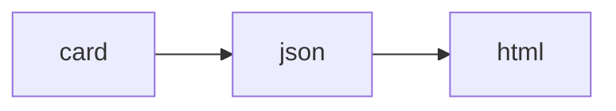

# hashcards

A plain text-based spaced repetition system. Features:

- **Plain Text:** all your flashcards are stored as plain text files, so you can
  operate on them with standard tools, write with your editor of choice, and
  track changes in a VCS.
- **Content Addressable:** cards are identified by the hash of their text. This
  means a card's progress is reset when the card is edited.
- **Low Friction:** you create flashcards by typing into a text file, using a
  lightweight notation to denote flashcard sides and cloze deletions.
- **Simple:** the only card types are front-back and cloze cards. More complex
  workflows (e.g.: Anki-style note types, card templates, automation) be can
  implemented using a Makefile and some scripts.
- **Efficient:** uses [FSRS] for scheduling reviews, maximizing learning while
  minimizing time spent reviewing.

> [!NOTE]
> This project is [hashcards](https://github.com/eudoxia0/hashcards)'s Go fork.


## Example

The following JSON file is a valid hashcards deck:

```json
[
  {
    "type": "Q",
    "question": "How many neurons are there in the human brain?",
    "answer": "~80 billion."
  },
  {
    "type": "C",
    "text": "An [agonist] is a ligand that binds to a receptor and [activates it]."
  },
  {
    "type": "Q",
    "question": "How many synapses are there in a human brain?",
    "answer": "~100 trillion"
  },
  {
    "type": "C",
    "text": "In the nervous system, [chemical] communication happens [between] neurons."
  }
]
```

The following Markdown file is a valid hashcards deck:

```markdown
Q: How many neurons are there in the human brain?
A: ~80 billion.

C: An [agonist] is a ligand that binds to a receptor and [activates it].

Q: How many synapses are there in a human brain?
A: ~100 trillion

C: In the nervous system, [chemical] communication happens [between] neurons.
```





## Tutorial

Create a directory for your flashcards, and add a Markdown file with some cards:

```bash
$ mkdir cards
$ cd cards
$ cat > Geography.md << 'EOF'
Q: What is Coulomb's constant?
A: The proportionality constant of the electric force.

Q: What is an object with zero net charge called?
A: Neutral.
EOF
```

A Markdown file is called a "deck", and the name of the file, sans extension, is
the name of the deck. This will be shown on top of the flashcard during reviews,
this saves you from having to specify the context in each of the flashcards.

Start drilling:

```bash
$ hashcards serve
```

This opens a web interface at `http://localhost:8000` where you can review your
cards. The interface is simple: you read the question, mentally recall the
answer, and click reveal (or press space). Then you grade yourself on how you
did, with one of four choices:

1. Forgot (shortcut: `1`)
2. Hard (shortcut: `2`)
3. Good (shortcut: `3`)
4. Easy (shortcut: `4`)

Be honest. If you got the answer almost right, press "Forgot". If you mis-grade
something, you can undo (shortcut: `u`). The session ends when every card has
been graded "Good" or higher. You can end the session prematurely by clicking
"End", this will save your changes.

To learn how to write good flashcards, read [Effective Spaced Repetition][esr].

## Commands

This section documents the hashcards command line interface.

### `serve`

Start a drilling session.

```bash
$ hashcards serve --dir [DIRECTORY] --config [FILE]
```

Note: your progress is not saved until the session ends, either when you run out
of cards, or when you click "End".

Options:

- `--card-limit=<N>`: Limit the session to at most N cards.
- `--new-card-limit=<N>`: Limit the number of new cards in the session.
- `--port=<PORT>`: Use a specific port (default: 8000).
- `--from-deck=<NAME>`: Only drill cards from a deck with the given name.
- `--open-browser=<true|false>`: Whether or not to open the browser after the
  server starts (default: true).

### `stats`

Print collection statistics to standard output.

```bash
$ hashcards stats [DIRECTORY]
```

Options:

- `--format=<FORMAT>`: Output format (`html` or `json`)

At present, only JSON output is supported.

### `check`

Check the integrity of a collection.

```bash
$ hashcards check [DIRECTORY]
```

### `orphans`

Manage orphan cards (cards that exist in the database, but not in the
collection, i.e., cards that were deleted from the collection).

```bash
$ hashcards orphans list [DIRECTORY]
$ hashcards orphans delete [DIRECTORY]
```

Example:

```
$ hashcards orphans list Cards
04effc035b71692b66a90a622559479516526e7720c41afa22b29562915d58af
059e4e0fd5c3d0ab7ef0cc902cdc402a555ec4152b842fe584109de6c8082ce3
061b8c27e0f437d0c6ae735e829b39cc3bf0ad8218cb16387dcb4271c20b244d
$ hashcards orphans delete Cards
04effc035b71692b66a90a622559479516526e7720c41afa22b29562915d58af
059e4e0fd5c3d0ab7ef0cc902cdc402a555ec4152b842fe584109de6c8082ce3
061b8c27e0f437d0c6ae735e829b39cc3bf0ad8218cb16387dcb4271c20b244d
$ hashcards orphans list Cards
# no output
```


## Database

hashcards stores card performance data and the review history in an SQLite3
database. The file is called `hashcards.db` and is found in the root of the card
directory (i.e., the path you pass to the `drill` command).

The `cards` table has the following schema:

| Column             | Type               | Description                                                                                                                         |
|--------------------|--------------------|-------------------------------------------------------------------------------------------------------------------------------------|
| `card_hash`        | `text primary key` | The hash of the card.                                                                                                               |
| `added_at`         | `text not null`    | The timestamp when the card was first added to the database, in timestamp format.                                                   |
| `last_reviewed_at` | `text`             | The timestamp when the card was most recently reviewed. `null` if the card is new.                                                  |
| `stability`        | `real`             | The card's stability. `null` if the card is new.                                                                                    |
| `difficulty`       | `real`             | The card's difficulty. `null` if the card is new.                                                                                   |
| `interval_raw`     | `real`             | The FSRS-calculated interval, before rounding and clamping. A real number of days until the next review. `null` if the card is new. |
| `interval_days`    | `real`             | The interval as an integer number of days, after rounding and clamping. `null` if the card is new.                                  |
| `due_date`         | `text`             | The date when the card is next due, in `YYYY-MM-DD` format. `null` if the card is new.                                              |
| `review_count`     | `integer not null` | The number of times the card has been reviewed.                                                                                     |

The `sessions` table has the following schema:

| Column       | Type                  | Description                                                  |
|--------------|-----------------------|--------------------------------------------------------------|
| `session_id` | `integer primary key` | The ID of the session.                                       |
| `started_at` | `text not null`       | The timestamp when the session started, in timestamp format. |
| `ended_at`   | `text not null`       | The timestamp when the session ended, in timestamp format.   |

The `reviews` table has the following schema:

| Column          | Type                  | Description                                                                                                                        |
|-----------------|-----------------------|------------------------------------------------------------------------------------------------------------------------------------|
| `review_id`     | `integer primary key` | The review ID.                                                                                                                     |
| `session_id`    | `integer not null`    | The ID of the session this review was performed in, a foreign key.                                                                 |
| `card_hash`     | `text not null`       | The hash of the card that was reviewed, a foreign key.                                                                             |
| `reviewed_at`   | `text not null`       | The timestamp when the review was performed (i.e., when the user submitted a grade).                                               |
| `grade`         | `text not null`       | One of `forgot`, `hard`, `good`, or `easy`.                                                                                        |
| `stability`     | `real not null`       | The card's stability after this review.                                                                                            |
| `difficulty`    | `real not null`       | The card's difficulty after this review.                                                                                           |
| `interval_raw`  | `real`                | The FSRS-calculated interval, before rounding and clamping. A real number of days until the next review `null` if the card is new. |
| `interval_days` | `real`                | The interval as an integer number of days, after rounding and clamping. `null` if the card is new.                                 |
| `due_date`      | `text not null`       | The date, in the user's local time, when the card is next due, in `YYYY-MM-DD` format.                                             |

Note: "timestamp format" is `YYYY-MM-DDTHH:MM:SS.MMM`, e.g. `2025-10-04T17:09:51.517`.

## オリジナルとの違い
SPA
- フラッシュカードはランダムに表示されることに意味があるので、SSRよりもSPAのほうが相性がよい。また画面遷移が高速なSPAのほうがよい。

PocketBase
- 学習中のカードの状態をSQLコマンドを使うことなく直接見ることができる。
- バックエンドとフロントエンドを分けてSPAにする場合に相性がよい。

Solid.js
- 複雑な画面レイアウトにも対応できるようにSolid.jsをつかう。とくに使わない理由はない。

json中間ファイル
- 元の実装のマークダウンパーサは、pythonスクリプトに移しmd→Json→htmlと、いう変換を重ねることにした。
- これにより、さまざまな場所に分散したノートをスクリプトによって集約しやすくなる。


## Prior Art

- [org-fc](https://github.com/l3kn/org-fc)
- [org-drill](https://orgmode.org/worg/org-contrib/org-drill.html)
- [hascard](https://hackage.haskell.org/package/hascard)
- [carddown](https://github.com/martintrojer/carddown)
- [My implementation of a personal mnemonic medium](https://notes.andymatuschak.org/My_implementation_of_a_personal_mnemonic_medium)

[FSRS]: https://github.com/open-spaced-repetition/fsrs4anki
[blog]: https://borretti.me/article/hashcards-plain-text-spaced-repetition
[cargo]: https://doc.rust-lang.org/cargo/
[esr]: https://borretti.me/article/effective-spaced-repetition
[fc]: https://github.com/eudoxia0/flashcards
[rustup]: https://rustup.rs/

## License
© 2026- by asano69. Licensed under the Apache 2.0 license.
© 2025–2026 by Fernando Borretti. Licensed under the Apache 2.0 license.

---
=> https://deepwiki.com/asano69/hashcards

---

=> https://gutenberg.org/cache/epub/47748/pg47748-images.html  
=> https://archive.org/details/reasonwhynathist00philrich/page/n5/mode/2up
