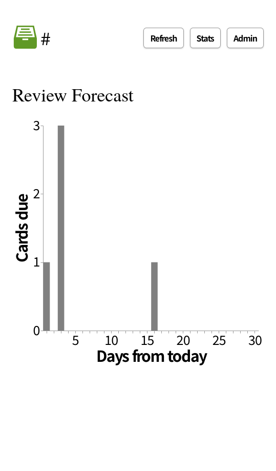

# hashcards


[](https://deepwiki.com/asano69/hashcards)

**A Go port of [hashcards](https://github.com/eudoxia0/hashcards): refactored with [PocketBase](https://github.com/pocketbase/pocketbase) × [SolidJS](https://github.com/solidjs/solid) into a more hackable, single-binary web application.**


Features:

- **Plain Text:** all your flashcards are stored as plain text files, so you can
  operate on them with standard tools, write with your editor of choice, and
  track changes in a VCS.
- **Content Addressable:** cards are identified by the hash of their text. This
  means a card's progress is reset when the card is edited.
- **Low Friction:** you create flashcards by typing into a text file, using a
  lightweight notation to denote flashcard sides and cloze deletions.
- **Simple:** the only card types are front-back and cloze cards. More complex
  workflows (e.g.: Anki-style note types, card templates, automation) be can
  implemented using a Makefile and some scripts.
- **Efficient:** uses [FSRS] for scheduling reviews, maximizing learning while
  minimizing time spent reviewing.


Differences from the Original:

- **SPA (Single Page Application)**: Flashcards are meant to be displayed randomly, which pairs much better with an SPA than with SSR (Server-Side Rendering). Additionally, an SPA is ideal for this project due to its lightning-fast page transitions.
- **PocketBase**: It allows you to directly check the state of cards currently being studied without having to run SQL commands. It also integrates seamlessly with an SPA architecture where the backend and frontend are decoupled.
- **SolidJS**: Solid.js was chosen to easily handle complex UI layouts.
- **JSON Intermediate Files**: The markdown parser from the original implementation has been moved to a Python script, changing the conversion workflow to: `Markdown → JSON → HTML`. This approach makes it much easier for the script to aggregate notes scattered across various locations.
- **Visibility**: Provides a detailed view of the cards' current status and offers clear visualization of the learning schedule.

Key Design Considerations: 

- **Streamlining flashcard creation**: By storing both annotation notes—used to mentally encode the logical structure of a topic—and question lists—used to test whether a program functions correctly—within the same context, we simplify the act of creating them. This allows us to fully channel our awareness into the learning content and the act of learning itself.

## Screenshot



## Example

The following JSON file is a valid hashcards deck:

```json
[
  {
    "kind": "basic",
    "question": "How many neurons are there in the human brain?",
    "answer": "~80 billion."
  },
  {
    "kind": "cloze",
    "text": "An [agonist] is a ligand that binds to a receptor and [activates it]."
  },
  {
    "kind": "basic",
    "question": "How many synapses are there in a human brain?",
    "answer": "~100 trillion"
  },
  {
    "kind": "cloze",
    "text": "In the nervous system, [chemical] communication happens [between] neurons."
  }
]
```
Please use the script of your choice to convert your flashcards into this format. A sample Python script is provided in the scripts directory.

## Tutorial

>[!CAUTION]
>While the databases for the Rust and Go port versions of hashcards are compatible, you cannot migrate by simply copying the file. The Go port version includes additional management ID columns used by PocketBase, as well as view tables for statistics. To migrate from the Rust version, you need to use a script to insert the data via the API.

```sh
# On a running server
uv run --with requests import_rust_hashcards.py ~/data/hashcards.db http://127.0.0.1:3000 admin@mail.internal password
```

Create a directory for your flashcards, and add a JOSN file with some cards:

```bash
$ mkdir cards
$ cd cards
$ cat > Geography.json << 'EOF'
[
  {
    "kind": "basic",
    "question": "What is Coulomb's constant?",
    "answer": "The proportionality constant of the electric force."
  },
  {
    "kind": "basic",
    "question": "What is an object with zero net charge called?",
    "answer": "Neutral."
  }
]
EOF
```

A JSON file is called a "deck", and the name of the file, sans extension, is
the name of the deck. This will be shown on top of the flashcard during reviews,
this saves you from having to specify the context in each of the flashcards.

Start drilling:

```bash
$ hashcards serve
```

This opens a web interface at `http://localhost:3000` where you can review your
cards. The interface is simple: you read the question, mentally recall the
answer, and click reveal (or press space). Then you grade yourself on how you
did, with one of four choices:

1. Forgot (shortcut: `1`)
2. Hard (shortcut: `2`)
3. Good (shortcut: `3`)
4. Easy (shortcut: `4`)

Be honest. If you got the answer almost right, press "Forgot". If you mis-grade
something, you can undo (shortcut: `u`). The session ends when every card has
been graded "Good" or higher. You can end the session prematurely by clicking
"End", this will save your changes.

## Recommended Workflow

1. In a Markdown editor such as Obsidian, take notes on the key points of the topic you want to learn.
2. Ask an AI to compile the essential knowledge required to understand the subject into a list of Q: A: pairs.
3. Copy the generated list into the Question sections (e.g. `## Quesiotn::DeckName {{Q&A}} ---`) .
4. Use a Python script or similar tool to extract the Question sections and convert their data structure into a JSON file that can be parsed by hashcards (Go).
5. Push the deck to a remote repository.
6. Define workflows as needed to reorganize or rebuild the deck.
7. Hook into the workflow completion event and redeploy the hashcards stack automatically.


## Commands

This section documents the hashcards command line interface.

### `serve`

Start a drilling session.

```bash
$ hashcards serve --dir [DATABASE_DIRECTORY]
```

Note: your progress is not saved until the session ends, either when you run out
of cards, or when you click "End".


### `stats`

Print collection statistics to standard output.

```bash
$ hashcards stats [DIRECTORY]
```

Options:

- `--format=<FORMAT>`: Output format (`html` or `json`)

At present, only JSON output is supported.

### `check`

Check the integrity of a collection.

```bash
$ hashcards check [DIRECTORY]
```

### `orphans`

Manage orphan cards (cards that exist in the database, but not in the
collection, i.e., cards that were deleted from the collection).

```bash
$ hashcards orphans list [DIRECTORY]
$ hashcards orphans delete [DIRECTORY]
```

Example:

```
$ hashcards orphans list Cards
04effc035b71692b66a90a622559479516526e7720c41afa22b29562915d58af
059e4e0fd5c3d0ab7ef0cc902cdc402a555ec4152b842fe584109de6c8082ce3
061b8c27e0f437d0c6ae735e829b39cc3bf0ad8218cb16387dcb4271c20b244d
$ hashcards orphans delete Cards
04effc035b71692b66a90a622559479516526e7720c41afa22b29562915d58af
059e4e0fd5c3d0ab7ef0cc902cdc402a555ec4152b842fe584109de6c8082ce3
061b8c27e0f437d0c6ae735e829b39cc3bf0ad8218cb16387dcb4271c20b244d
$ hashcards orphans list Cards
# no output
```

## Environment Variables

`hashcards serve` reads its configuration from environment variables. All are optional; defaults are shown below.

| Variable              | Default   | Description                                                                 |
|------------------------|-----------|------------------------------------------------------------------------------|
| `SERVER_HOST`          | `0.0.0.0` | Host address the HTTP server binds to.                                       |
| `SERVER_PORT`          | `3000`    | Port the HTTP server listens on.                                             |
| `DATA_ROOT`            | `.`       | Path to the collection directory (where your deck `.json` files live).       |
| `FSRS_TARGET_RECALL`   | `0.9`     | Target recall probability (0–1) used to compute review intervals.            |
| `FSRS_MIN_INTERVAL`    | `1.0`     | Minimum interval (in days) between reviews.                                  |
| `FSRS_MAX_INTERVAL`    | `256.0`   | Maximum interval (in days) between reviews.                                  |

Example:

```bash
SERVER_HOST=0.0.0.0
SERVER_PORT=3000
DATA_ROOT=./cards
FSRS_TARGET_RECALL=0.9
FSRS_MIN_INTERVAL=1.0
FSRS_MAX_INTERVAL=256.0
```

These can be set directly, via `.envrc`/`direnv`, or (as in `hashacrds.env` and `compose.yaml`) loaded from a file / passed to the Docker container.

## Database

hashcards stores card performance data and review history in the SQLite3 database managed by PocketBase.

The `cards` table has the following schema:

| Column | Type | Description |
| :--- | :--- | :--- |
| **`id`** | **`text primary key`** | **`Randomly generated unique ID (e.g., 'r...').`** |
| `card_hash` | ~~`text primary key`~~ **`text not null default ''`** | The hash of the card. **`Has a UNIQUE index constraint.`** |
| `added_at` | `text not null` | The timestamp when the card was first added to the database, in timestamp format. |
| `last_reviewed_at` | ~~`text`~~ **`text not null default ''`** | The timestamp when the card was most recently reviewed. ~~`null`~~ **`Empty string`** if the card is new. |
| `stability` | ~~`real`~~ **`numeric not null default 0`** | The card's stability. ~~`null`~~ **`0`** if the card is new. |
| `difficulty` | ~~`real`~~ **`numeric not null default 0`** | The card's difficulty. ~~`null`~~ **`0`** if the card is new. |
| `interval_raw` | ~~`real`~~ **`numeric not null default 0`** | The FSRS-calculated interval, before rounding and clamping. A real number of days until the next review. ~~`null`~~ **`0`** if the card is new. |
| `interval_days` | ~~`real`~~ **`numeric not null default 0`** | The interval as an integer number of days, after rounding and clamping. ~~`null`~~ **`0`** if the card is new. |
| `due_date` | ~~`text`~~ **`text not null default ''`** | The date when the card is next due, in `YYYY-MM-DD` format. ~~`null`~~ **`Empty string`** if the card is new. |
| `review_count` | `integer not null` | The number of times the card has been reviewed. |

The `sessions` table has the following schema:

| Column | Type | Description |
| :--- | :--- | :--- |
| ~~`session_id`~~ **`id`** | ~~`integer primary key`~~ **`text primary key default ('r'\|\|lower(hex(randomblob(7))))`** | The ID of the session. |
| `started_at` | ~~`text not null`~~ **`text not null default ''`** | The timestamp when the session started, in timestamp format. **`Has an index constraint.`** |
| `ended_at` | ~~`text not null`~~ **`text not null default ''`** | The timestamp when the session ended, in timestamp format. |

The `reviews` table has the following schema:

| Column | Type | Description |
| :--- | :--- | :--- |
| **`id`** | **`text primary key default ('r'\|\|lower(hex(randomblob(7))))`** | **`The review ID. Randomly generated unique ID.`** |
| ~~`review_id`~~ | ~~`integer primary key`~~ | *(This column was replaced by `id`)* |
| `session_id` | ~~`integer not null`~~ **`text not null default ''`** | The ID of the session this review was performed in, a foreign key. **`Has an index constraint.`** |
| `card_hash` | `text not null` **`default ''`** | The hash of the card that was reviewed, a foreign key. **`Has an index constraint.`** |
| `reviewed_at` | ~~`text not null`~~ **`text not null default ''`** | The timestamp when the review was performed (i.e., when the user submitted a grade). |
| `grade` | ~~`text not null`~~ **`text not null default ''`** | One of `forgot`, `hard`, `good`, or `easy`. |
| `stability` | ~~`real not null`~~ **`numeric not null default 0`** | The card's stability after this review. |
| `difficulty` | ~~`real not null`~~ **`numeric not null default 0`** | The card's difficulty after this review. |
| `interval_raw` | ~~`real`~~ **`numeric not null default 0`** | The FSRS-calculated interval, before rounding and clamping. A real number of days until the next review. ~~`null`~~ **`0`** if the card is new. |
| `interval_days` | ~~`real`~~ **`numeric not null default 0`** | The interval as an integer number of days, after rounding and clamping. ~~`null`~~ **`0`** if the card is new. |
| `due_date` | ~~`text not null`~~ **`text not null default ''`** | The date, in the user's local time, when the card is next due, in `YYYY-MM-DD` format. |

>[!NOTE]
>- "timestamp format" is `YYYY-MM-DDTHH:MM:SS.MMM`, e.g. `2025-10-04T17:09:51.517`.


## Prior Art

- [org-fc](https://github.com/l3kn/org-fc)
- [org-drill](https://orgmode.org/worg/org-contrib/org-drill.html)
- [hascard](https://hackage.haskell.org/package/hascard)
- [carddown](https://github.com/martintrojer/carddown)
- [My implementation of a personal mnemonic medium](https://notes.andymatuschak.org/My_implementation_of_a_personal_mnemonic_medium)

[FSRS]: https://github.com/open-spaced-repetition/fsrs4anki
[blog]: https://borretti.me/article/hashcards-plain-text-spaced-repetition
[cargo]: https://doc.rust-lang.org/cargo/
[esr]: https://borretti.me/article/effective-spaced-repetition
[fc]: https://github.com/eudoxia0/flashcards
[rustup]: https://rustup.rs/

## License
© 2026- by asano69. Licensed under the Apache 2.0 license.  
© 2025–2026 by Fernando Borretti. Licensed under the Apache 2.0 license.  

---


To learn how to write good flashcards, read [Effective Spaced Repetition][esr].  
=> https://gutenberg.org/cache/epub/47748/pg47748-images.html  
=> https://archive.org/details/reasonwhynathist00philrich/page/n5/mode/2up  
